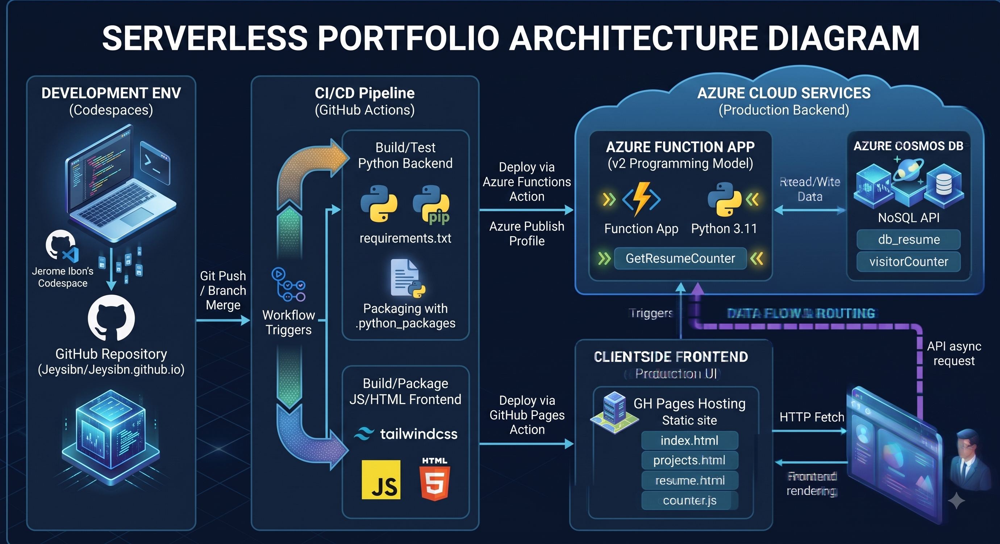

# Jeysibn's Cloud Resume Challenge

Welcome to the repository for my Cloud Resume portfolio. I am an aspiring Cloud and DevOps Engineer passionate about IT infrastructure. I hold an OCI Foundation Associate certificate and enjoy building projects to expand my skills. I am also an active AI utilizer, leveraging modern tools to accelerate learning and development.

## 🔗 Links
- **Portfolio Website:** [Jeysibn Profile](https://jeysibn.github.io/portfolio)
- **LinkedIn:** [Jerome Christian Ibon](https://www.linkedin.com/in/jeromeibon)
- **GitHub:** [@Jeysibn](https://github.com/Jeysibn)

## 🏗️ Architecture


- **Frontend:** HTML/JS + Tailwind CSS, hosted on GitHub Pages.
- **Backend:** Azure Functions (Python) serverless API.
- **Database:** Azure Cosmos DB (Table API / Serverless).
- **IaC:** Terraform managing Azure resources (deployed to `koreacentral`).
- **CI/CD:** GitHub Actions.

## 🚀 Bootstrap: Terraform Remote State
Before running the CI/CD pipeline, the Terraform remote state storage must be created in Azure. 

Run these Azure CLI commands locally to create the Storage Account for the `.tfstate` file:

```bash
# 1. Login to Azure
az login

# 2. Create the Resource Group for Terraform State
az group create --name rg-terraform-state --location koreacentral

# 3. Create the Storage Account
az storage account create --name sttfstatejeysibn --resource-group rg-terraform-state --location koreacentral --sku Standard_LRS --encryption-services blob

# 4. Create the Blob Container
az storage container create --name tfstate --account-name sttfstatejeysibn
